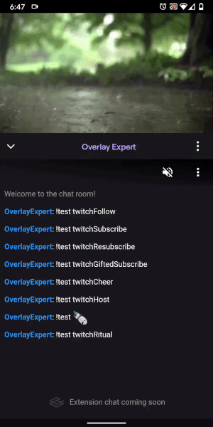

# Twitch Extension

## General

### Twitch Extensions and how to activate them

Are you a Streamer? See [here](https://www.twitch.tv/p/extensions) to learn more
about Extensions and how to activate them!

---

## FAQ

### Why doesn't my overlay show on mobile (or other platform)?

Twitch determines the capabilities of extensions on the different platforms.

On mobile, Twitch does not allow extensions to overlay the video, so the
experience is slightly different. On mobile, the extension shows your chat view
(read-only), and your alerts appear above your chat. You will need to instruct
your viewers to open the extension. On the right is a preview of the experience.
Chatting from the extension is coming soon.

Another option is to ask your viewers to view your stream from a mobile browser
in "desktop mode".

Twitch does not provide extension functionality when viewing from other
platforms, such as consoles.

Until Twitch improves the extension experience on the various platforms, the
complete overlay will only visible on desktop computers.

Your voice matters If you would like to see better support for overlay extension
on mobile and other platforms, please:

- [Vote for this Twitch suggestion](https://twitch.uservoice.com/forums/904711-extensions/suggestions/40301335-allow-overlay-extensions-to-overlay-the-video-on-m)
- [Tweet @Twitch and @TwitchDev](https://twitter.com/intent/tweet?text=Please%20allow%20overlay%20extensions%20to%20overlay%20the%20video%20on%20mobile%20%40Twitch%20%40TwitchDev%20%40OverlayExpert)
  ([en español](https://twitter.com/intent/tweet?text=Por%20favor%2C%20permitan%20Extensiones%20de%20Overlays%20como%20%40OverlayExpert%20sobreponese%20al%20video%20reproductor%20en%20dispositivos%20m%C3%B3viles%20%40Twitch%20%40TwitchDev%20%40TwitchES))

### Is it normal that the viewer must always unmute the overlay?

Yes, this is a Twitch policy. The viewer must always unmute the overlay to be
able to hear sounds and alerts.

### Why can't I see my overlay in past broadcasts or clips?

Twitch determines the capabilities of extensions and currently, overlay
extensions are only visible on live streams.

### Why can't I see URL widgets?

URL widgets use
[inline frame elements](https://developer.mozilla.org/en-US/docs/Web/HTML/Element/iframe)
(or `<iframe>`) and, for security reasons, Twitch does not allow the use of
`<iframe>`s in extensions.

### Is it possible to play music through the overlay?

We are actively looking into providing music through the overlay; but until a
free source of music that can be integrated without the use of `<iframe>`'s (see
abvoe), unfortunately this is not possible at the moment.
